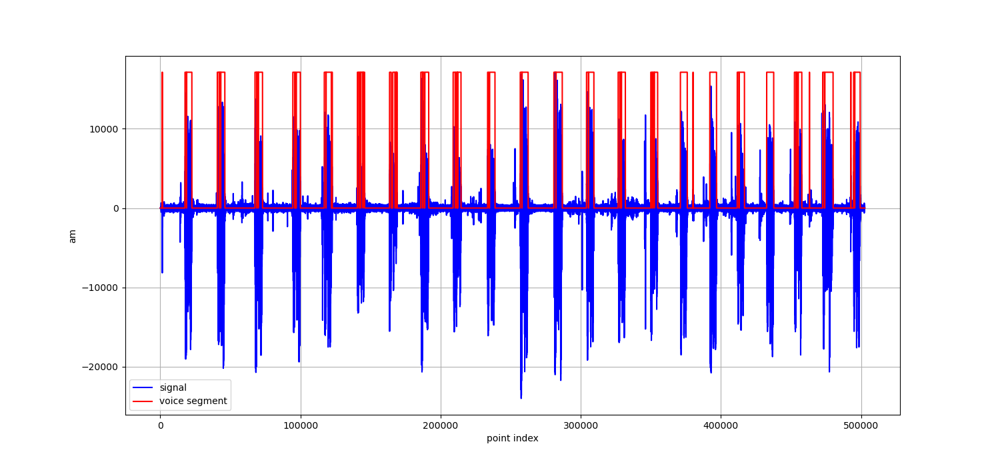
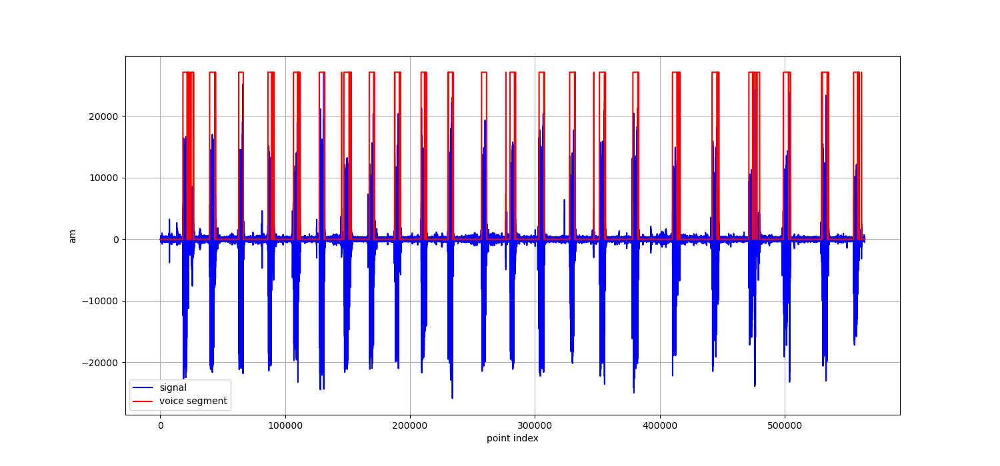
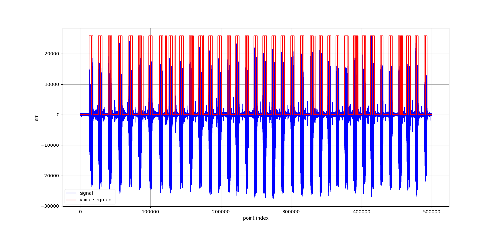

# 算法设计

> 主要使用 CNN 神经网络对时序信息的处理能力

1. 数据在 CNN 神经网络中首先进行一维卷积操作，卷积核设置为 2，Slide 值设置为 2。并输出为 2 个通道（经过测试，3 个及 3 个以上通道收益不佳，故采用两个通道）。
2. 输出的进行批量归一化
3. 输入到 relu 非线性层中
4. `Flatten`
5. 过一层线性层
6. 最后再过一层非线性 (softmax)

使用交叉熵函数计算 Loss 值和 Adam 算法进行优化。

## 数据集生成方法

语音信号会被分为大量的语音片段（240 个点），其被作为数据输入到神经网络中，大小为`[N, 1, 1, 240]`。

- reshape 为四维矩阵的是为了使用`Conv2d`函数，如果使用`Conv1d`，则应该更改维度。

Label 根据语音片段和原始 Label 标记进行生成，如果语音片段**完全**位于标记的语音信号片段中，则 Label 为 1，否则为 0。例如，`[100, 1000]`的区间被标记为语音信号，那么对于音频片段`[0:240]`，其 label 为 0，对于片段`[240:480]`其 label 为 1。

## 运行方法

1. `python model.py`进行模型训练，并在目录下生成`model.pth`
2. `python main.py` 进行算法测试以及绘图，并在 predict 生成预测文件
3. `python evaluate.py` 进行分数评估

## 使用的 Python 库版本 & Bug 排查

本实验使用的库均为官方样例中的库，其中 Pytorch 版本为`2.3.0`。其他的库版本可以参见[yml 文件](./vad.yml)，但版本不同应该不会造成 Exception.

值得注意的是，model 使用了 MPS 进行训练，因此在部分电脑上直接加载模型可能会存在问题。

# VAD 测试报告

## 语音识别结果如图所示

  

---

从图中可以看出，CNN 网络可以很好的标记出语音信号，并且不受弱噪音的影响。

本实验还使用了 evaluate.py 对结果进行了进一步评估，结果如下所示。

```sh
# Data 1
f1_score:  0.9211778447162968
accuracy:  0.9615808552885514
recall:  0.8668749276871457
precision:  0.9827387198321091

```

```sh
# Data 2
f1_score:  0.9057907949790794
accuracy:  0.9599275955848199
recall:  0.8601557533375715
precision:  0.9565394132202192
```

```sh
# Data 3
f1_score:  0.8669993648489248
accuracy:  0.8970084366132595
recall:  0.7875103021169378
precision:  0.9643367935409458
```

均可以达到一个比较好的效果。

# C 语言推理

## 步骤

1. 编译
   1. 将模型训练后的参数写入 `model_parameters.h`
   2. 编译为 `a.exe`
2. 测试
   1. 将 `data/data_1.wav` 写入 `data.txt`
   2. 运行 `a.exe`
   3. 将输出的 `pred.txt` 复制为 `predict/data_1.txt`
   4. 使用 `evaluate.py` 测试
   5. 为 `data_2`, `data_3` 重复上述过程

Compile:

```ps1
# cwd: repo/c
gcc *.c
```

Test:

```ps1
# cwd: repo/c
$data_i="data_1" # or 2, 3
python .\generate_data.py $data_i
./a.exe
cp pred.txt "predict/$data_i.txt"
python .\evaluate.py $data_i
```

## 结果

结果如下，与 python 测试结果一致

data_1

```
f1_score:  0.9211778447162968
accuracy:  0.9615808552885514
recall:  0.8668749276871457
precision:  0.9827387198321091
```

data_2

```
f1_score:  0.9057907949790794
accuracy:  0.9599275955848199
recall:  0.8601557533375715
precision:  0.9565394132202192
```

data_3

```
f1_score:  0.8669993648489248
accuracy:  0.8970084366132595
recall:  0.7875103021169378
precision:  0.9643367935409458
```
